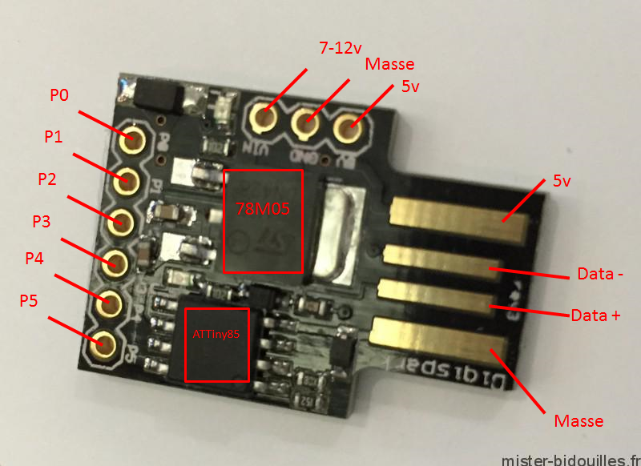

# QiCycle Button

For the DigisSpark - ATTiny85

## Warning:
* This version is untested!
* Check your local regulations before using this.
* Use at own risk

## DigiSpark - ATTiny85

## Button

* GND   -> cable 1
* PIN 0 -> cable 2 (it doesn't matter which is which)

## PAS:

* VIN   -> (+) 
* GND   -> (-) 
* PIN 2 -> (data) 

## Recomended

* Remove the 5 second bootloader wait
https://digistump.com/board/index.php/topic,2928.msg13641.html#msg13641
