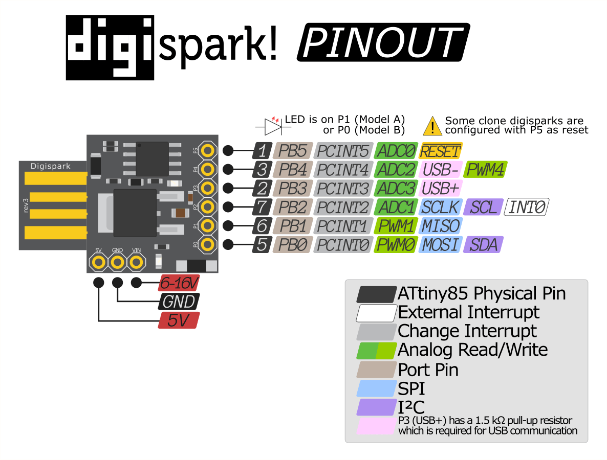

# QiCycle Button

For the DigisSpark - ATTiny85

## Warning:

- Check your local regulations before using this.
- Use at own risk

## Usage:

- Push to throttle
- 2 clicks for cruise mode (off by pushing again)
- 5 clicks for kill switch (disables button completely)

# Wiring

## DigiSpark - ATTiny85

## Button

- GND -> cable 1
- PIN 0 -> cable 2 (it doesn't matter which is which)

## PAS:

- 5V -> (+)
- GND -> (-)
- PIN 2 -> (data)

## Recomended

- Remove the 5 second bootloader wait
  https://digistump.com/board/index.php/topic,2928.msg13641.html#msg13641
- If you do this, to upload the code you have to ground P0 while plugging it to the USB (i.e press the bike button)
